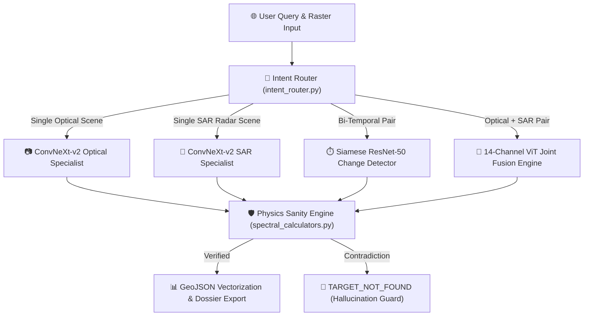

# 🛰️ Geospatial AI Reasoning Engine & Multimodal Earth Observation Platform

A production-grade, offline-first geospatial artificial intelligence reasoning engine designed for multimodal Earth Observation (EO) data. The system combines multi-spectral optical surface reflectance, Synthetic Aperture Radar (SAR) C-band backscatter, bi-temporal change detection, and cross-modal 14-channel Vision Transformer (ViT) fusion under deterministic physics guardrails.

---

## 📑 Table of Contents

- [Key Capabilities & Innovations](#-key-capabilities--innovations)
- [System Architecture](#-system-architecture)
  - [Refactored Directory Layout](#refactored-directory-layout)
  - [Four-Tier Decoupled Architecture](#four-tier-decoupled-architecture)
- [Mathematical & Remote Sensing Physics](#-mathematical--remote-sensing-physics)
- [Neural Specialist Ensemble](#-neural-specialist-ensemble)
- [Installation & Setup Guide](#-installation--setup-guide)
- [Command Line Interface (CLI) Usage](#-command-line-interface-cli-usage)
- [REST API Endpoints](#-rest-api-endpoints)
- [Web Dashboard (React 19)](#-web-dashboard-react-19)
- [Verification & Automated Test Suite](#-verification--automated-test-suite)
- [License & Open Source Integrity](#-license--open-source-integrity)

---

## ✨ Key Capabilities & Innovations

1. **Multimodal Satellite Ingestion**: Supports 16-bit multi-spectral optical stacks (Sentinel-2 L2A BOA reflectance), dual-polarization C-band SAR backscatter rasters ($\text{VV}, \text{VH}$ in decibels), and high-resolution visual imagery.
2. **Deterministic Physics Sanity Engine**: Enforces McFeeters NDWI, Xu MNDWI, Rouse NDVI, and SAR microwave backscatter attenuation ($\sigma^0_{\text{VV}} \le -16\text{ dB}$) to eliminate neural network hallucinations.
3. **Adaptive Otsu Thresholding**: Calculates dynamic scene-specific spectral decision bounds per raster tile instead of static global cutoffs.
4. **Sub-Pixel Contour Vectorization**: Emits OGC RFC 7946 GeoJSON vector polygons using sub-pixel contour smoothing (`approxPolyDP`) and calculates real-world ground area in hectares.
5. **Agentic Task Intent Router**: Parses multi-modal natural language user queries and automatically dispatches execution to specialized neural backbones.
6. **Cinematic Zero-Delay Landing Interface**: Full GPU-accelerated video background, unified `SATQUERY-AI` branding in Space Grotesk (`SATQUERY-` in white, `AI` in `#34d399`), zero-delay initial rendering, and direct center Launch CTA.
7. **Standalone In-App Satellite Time-Series Viewer**: Dedicated Earth observation window embedding ArcGIS Wayback time-series imagery directly within the platform with pinpoint Indian coordinates (Pune, Mumbai, Surat, Jaipur) and no external redirects.
8. **100% Offline Air-Gapped Capable**: Core reasoning engine runs fully local on standard CPU or GPU hardware without mandatory cloud or external API dependencies.

---

## 🏗️ System Architecture

### Refactored Directory Layout

```text
.
├── cli_runner.py                     <-- Interactive command-line interface
├── server_entry.py                   <-- Enterprise REST API backend server (Port 8000)
├── REFACTORED_ARCHITECTURE_PLAN.md   <-- Refactoring specifications & technical roadmap
├── README.md                         <-- System documentation & technical guide
├── REPORT.md                         <-- Technical verification & benchmark report
├── requirements.txt                  <-- Core Python dependencies
├── render.yaml                       <-- Cloud deployment configuration
│
├── geospatial_engine/                <-- Core Geospatial AI Engine Package
│   ├── ENGINE_SPECIFICATION.md       <-- Deep architectural ledger & physics formulas
│   ├── verify_pipeline.py            <-- Offline integration test suite (5/5 benchmarks)
│   ├── configs/
│   │   ├── model_registry.yaml       <-- Neural specialist backbone configurations
│   │   └── spectral_indices.yaml     <-- Band formulas, thresholds & physics rules
│   └── src/
│       ├── core_processor.py         <-- Master engine pipeline coordinator (GeospatialAIEngine)
│       ├── controller/
│       │   ├── data_schemas.py       <-- Pydantic v2 schemas & audit contracts
│       │   └── intent_router.py      <-- Multi-modal natural language intent router
│       ├── ingestion/
│       │   ├── raster_loader.py      <-- 16-bit GeoTIFF reader & CRS georeferencer
│       │   └── tensor_preprocessors.py<-- Surface reflectance & SAR decibel calibrators
│       ├── physics/
│       │   ├── spectral_calculators.py<-- Deterministic NDWI, NDVI, MNDWI & Otsu thresholders
│       │   ├── geospatial_metrics.py <-- Ground resolution & hectare area calculators
│       │   └── contour_vectorizer.py <-- Sub-pixel GeoJSON polygon vectorizer
│       ├── specialists/
│       │   ├── monotemporal_specialist.py    <-- ConvNeXt-v2 single-scene backbone
│       │   ├── bitemporal_change_detector.py <-- Siamese ResNet-50 change engine
│       │   └── multimodal_fusion_specialist.py<-- 14-Channel ViT joint optical-SAR backbone
│       └── export/
│           ├── dossier_exporter.py    <-- JSON & Markdown analytical report generator
│           └── result_visualizer.py   <-- Binary mask, heatmap & overlay renderer
│
├── ui-ux-frontend/                   <-- Standalone Modern Frontend Workspace (React 19 + Vite)
│   ├── BACKEND_INTEGRATION.md        <-- API contract & connection specifications
│   ├── package.json
│   ├── vite.config.ts
│   └── src/
│       ├── App.tsx                   <-- Application routes (/, /app, /satellite-view)
│       ├── components/
│       │   ├── landing/              <-- CinematicLandingPage & showcase components
│       │   ├── satellite/            <-- SatelliteViewerPage (ArcGIS Wayback + Indian presets)
│       │   ├── dashboard/            <-- AI analysis workspace, metrics & uploads
│       │   └── layout/               <-- Responsive headers & unified wordmarks
│       └── services/apiService.ts    <-- FastAPI REST client (Port 8000)
│
└── web_dashboard/                    <-- Production Dashboard Client (Synced with ui-ux-frontend)
    ├── BACKEND_INTEGRATION.md
    ├── package.json
    ├── vite.config.ts
    └── src/                          <-- Full production source code & components
```

---

## 🧮 Mathematical & Remote Sensing Physics

All neural predictions are cross-examined against deterministic radiometric formulations:

| Physics Index / Metric | Mathematical Equation | Purpose & Decision Rule |
| :--- | :--- | :--- |
| **Surface Reflectance** | $\rho_{\lambda} = \frac{\text{DN}_{\lambda}}{10000.0}$ | Normalizes 16-bit Sentinel-2 BOA integers into $[0.0, 1.0]$. |
| **SAR Decibels** | $\sigma^0_{\text{dB}} = 10 \cdot \log_{10}(\max(I, \epsilon))$ | Converts C-band radar intensity to decibels ($\epsilon = 10^{-7}$). |
| **NDWI (McFeeters)** | $\frac{\rho_{\text{Green}} - \rho_{\text{NIR}}}{\rho_{\text{Green}} + \rho_{\text{NIR}} + \epsilon}$ | Water delineation ($\text{NDWI} > 0.0$). |
| **MNDWI (Xu)** | $\frac{\rho_{\text{Green}} - \rho_{\text{SWIR1}}}{\rho_{\text{Green}} + \rho_{\text{SWIR1}} + \epsilon}$ | Urban-resilient water extraction ($\text{MNDWI} > 0.0$). |
| **NDVI (Rouse)** | $\frac{\rho_{\text{NIR}} - \rho_{\text{Red}}}{\rho_{\text{NIR}} + \rho_{\text{Red}} + \epsilon}$ | Chlorophyll biomass validation ($\text{NDVI} > 0.35$). |
| **SAR Water Gate** | $\sigma^0_{\text{VV}} \le -16.0\text{ dB}, \quad \sigma^0_{\text{VH}} \le -23.0\text{ dB}$ | Specular reflection water validation. |

---

## 🔬 Neural Specialist Ensemble



---

## 🛠️ Installation & Setup Guide

### Prerequisites
- Python 3.10+
- Node.js 18+ and npm
- GDAL binaries / Rasterio pre-built wheels

### Step 1: Environment Setup
```bash
# Clone the repository
git clone https://github.com/Jaytavanoji/SatQuery-Ai.git
cd SatQuery-Ai

# Create virtual environment
python -m venv venv
source venv/bin/activate  # On Windows: venv\Scripts\activate

# Install Python dependencies
pip install -r requirements.txt
```

### Step 2: Frontend Setup
```bash
cd web_dashboard
npm install
npm run build
cd ..
```

---

## 🖥️ Command Line Interface (CLI) Usage

Run the headless terminal interface using `cli_runner.py`:

```bash
# 1. Run full 5-part test pipeline (100% offline verification)
python geospatial_engine/verify_pipeline.py

# 2. Execute optical water detection query
python cli_runner.py --image data/inputs/samples/sentinel2_godavari_pre.tif --query "Delineate all open water bodies and lakes"

# 3. Execute bi-temporal change detection
python cli_runner.py --bitemporal

# 4. Execute cross-modal optical + SAR fusion
python cli_runner.py --crossmodal
```

---

## 🌐 REST API Endpoints

Launch the REST API server on Port 8000:

```bash
python server_entry.py
```

### Key API Routes

| Endpoint | Method | Description |
| :--- | :---: | :--- |
| `/api/health` | `GET` | Health check, device status (CUDA/CPU), and specialist catalog. |
| `/api/models` | `GET` | Catalog of 6 neural specialist backbones and latency metrics. |
| `/api/upload` | `POST` | Ingests satellite rasters and generates web PNG previews. |
| `/api/analyze` | `POST` | Main reasoning pipeline endpoint returning metrics, GeoJSON, and URLs. |
| `/api/chat` | `POST` | Conversational Earth Observation copilot endpoint. |
| `/api/reports` | `GET` | Catalog of archived analytical inspection reports. |

---

## 💻 Modern Web Frontend (React 19 + TypeScript + Tailwind)

Launch the modern frontend workspace on Port 5173:

```bash
# Launch from web_dashboard or ui-ux-frontend
cd web_dashboard
npm install
npm run dev
```

### Key Routes & Capabilities:
- **`/` — Cinematic Landing Page**:
  - Live 60FPS video hero featuring Earth from orbit with zero initialization delay.
  - Unified uppercase **`SATQUERY-AI`** branding (`Space Grotesk`, `#34d399` AI accent, pure typography without placeholder frames).
  - Centered high-contrast **Launch** button transitioning immediately to `/app`.
  - Comprehensive feature showcase: Agentic vs Legacy comparison, foundation architecture breakdown, and verified SOTA benchmarks.
- **`/satellite-view` & `/workspace` — Standalone In-App Satellite View**:
  - Direct ArcGIS Wayback global archive embedded securely within the application.
  - Pinpoint Indian metropolitan presets: **Pune** (`73.85674°E, 18.52043°N`), **Mumbai** (`72.83465°E, 18.92200°N`), **Surat** (`72.83106°E, 21.17024°N`), and **Jaipur** (`75.82674°E, 26.92394°N`).
  - Native fullscreen inspection, instant refresh, and telemetry status overlay without external page redirects.
- **`/harmonized-landsat` & `/hls` — Standalone Harmonized Landsat Engine (NASA Earthdata)**:
  - Embedded NASA Worldview HLS engine with one-click direct access to Indian remote sensing datasets:
    - 🌾 **Crop Cycles**: Vegetation greening & NDVI cycles over Punjab & Indo-Gangetic agricultural belt.
    - 🌊 **Disaster Impact**: Before-and-after floodwater boundary mapping over Assam Brahmaputra Basin.
    - 🌲 **Deforestation**: Forest canopy dynamics & land use tracking along Western Ghats.
    - 🏔️ **Snow & Ice**: Glacier retreat & snowpack monitoring over Himachal & Indian Himalayas.
- **`/app` — AI Earth Observation Operations Dashboard**:
  - **Interactive Split-Slider Evidence Viewer**: Drag vertical partition across original raster and neural inference overlay.
  - **Multi-Spectral Radiance & Reflectance Graphs**: 12-band spectral reflectance curves and automated land-cover composition.
  - **One-Click Vector Export**: Instant RFC 7946 GeoJSON vector polygon export with computed ground area in hectares.
  - **Forensic Report Generation**: Downloadable Markdown and machine-readable JSON dossiers.

---

## 🧪 Verification & Automated Test Suite

All 5 backend benchmarks pass 100% offline:

```bash
python geospatial_engine/verify_pipeline.py
```

**Benchmark Results:**
- `[1/5]` Synthetic 16-Bit Rasters Creation: **PASS**
- `[2/5]` Single Image Optical Specialist (`ConvNeXt-v2 S2`): **PASS**
- `[3/5]` Single Image SAR Specialist (`ConvNeXt-v2 S1`): **PASS**
- `[4/5]` Bi-Temporal Change Detector (`Siamese ResNet-50`): **PASS**
- `[5/5]` Cross-Modal Fusion Specialist (`14-Channel ViT`): **PASS**

---

## 📄 License & Open Source Integrity

This project is distributed under the Apache License 2.0. See the `LICENSE` file for details. All source code, physics algorithms, and neural backbones are open-source and air-gapped capable.
